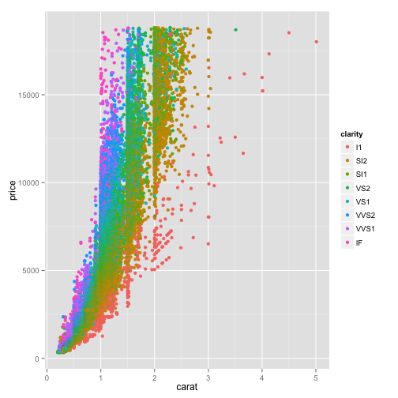

<style>
.title-slide {
  background-color: antiquewhite;
}


</style>

---
## Welcome!

> * My name is James Curley

> * I am from England.

> * I'm an Asst. Professor at Columbia.

> * I'm going to show you some things using slidify.

*** Presenter notes

you can put notes here - they won't show up in html (actually, I don't know where they show up)

---


## Slide 1

This is our first slide

--- .class #id 

## Slide 2
 
This is our second slide


--- {class: class1, id: id1, bg: yellow}

## You can change background colors


to this yucky yellow, for instance


--- bg:dodgerblue

**or any other color you might like**


--- 

## Animated lists are easy

> 1. Point 1
> 2. Point 2
> 3. Point 3

---

 
## So are bullet lists
 
> * First bullet point to appear
 
> * Second...


--- &radio
## Useful for online learning

### Question 1

What is 1 + 1?

1. 1
2. _2_
3. 3
4. 4

*** .hint
This is a hint

*** .explanation
This is an explanation


---

# Mathjax !

you can write mathemetical formulas:

$$ \begin{aligned} \nabla \times \vec{\mathbf{B}} -\, \frac1c\, \frac{\partial\vec{\mathbf{E}}}{\partial t} & = \frac{4\pi}{c}\vec{\mathbf{j}} \ \nabla \cdot \vec{\mathbf{E}} & = 4 \pi \rho \ \nabla \times \vec{\mathbf{E}}\, +\, \frac1c\, \frac{\partial\vec{\mathbf{B}}}{\partial t} & = \vec{\mathbf{0}} \ \nabla \cdot \vec{\mathbf{B}} & = 0 \end{aligned} $$


this is another one:

$$ \mathbf{V}_1 \times \mathbf{V}_2 = \begin{vmatrix} \mathbf{i} & \mathbf{j} & \mathbf{k} \ \frac{\partial X}{\partial u} & \frac{\partial Y}{\partial u} & 0 \ \frac{\partial X}{\partial v} & \frac{\partial Y}{\partial v} & 0 \end{vmatrix} $$

---  

## We can write lists

- We say something
- And something else
- **But,** we are careful **not** to be boring
- **This is so exicting** now I know how to do this
- yadda, yadda, yadda

---

## Insert web links - might be useful

### http://jknowles.github.com/Jan2013SDPtalk


This is useful if we publish our slides to e.g. GitHub for others to view

--- .class #id

## mtcars dataset - Description

### Motor Trend Car Road Tests

> The data was extracted from the 1974 Motor Trend US magazine, and comprises fuel consumption and 10 aspects of automobile design and performance for 32 automobiles (1973-74 models).

### Source
> Henderson and Velleman (1981), Building multiple regression models interactively. Biometrics, 37, 391-411.


```r
library(datasets)
head(mtcars, 3)
```

```
##                mpg cyl disp  hp drat    wt  qsec vs am gear carb
## Mazda RX4     21.0   6  160 110 3.90 2.620 16.46  0  1    4    4
## Mazda RX4 Wag 21.0   6  160 110 3.90 2.875 17.02  0  1    4    4
## Datsun 710    22.8   4  108  93 3.85 2.320 18.61  1  1    4    1
```

---

## mtcars dataset - Format

**A data frame with 32 observations on 11 variables.**

| Index | Field | Detail |
------- | ----- | ------ |
| [, 1] | mpg | Miles/(US) gallon |
| [, 2] | cyl | Number of cylinders |
| [, 3] | disp | Displacement (cu.in.) |
| [, 4] | hp | Gross horsepower |
| [, 5] | drat | Rear axle ratio |
| [, 6] | wt | Weight (lb/1000) |
| [, 7] | qsec | 1/4 mile time |
| [, 8] | vs | V/S |
| [, 9] | am | Transmission (0 = automatic, 1 = manual) |
| [,10] | gear | Number of forward gears |
| [,11] | carb | Number of carburetors |

---
  
## Example
  
  - You flip a coin, $X$ and simulate a uniform random number $Y$, what is the expected value of their sum? 
$$
  E[X + Y] = E[X] + E[Y] = .5 + .5 = 1
$$ 


- Another example, you roll a die twice. What is the expected value of the average? 
- Let $X_1$ and $X_2$ be the results of the two rolls
$$
  E[(X_1 + X_2) / 2] = \frac{1}{2}(E[X_1] + E[X_2])
= \frac{1}{2}(3.5 + 3.5) = 3.5
$$
  

---
## Pictures

You can put pictures into your slides:.. not sure why not working???


--- &twocol
This slides has two columns

*** =left
this is written over here on the left.... there isn't much more to say about that

*** =right
whilst this is on the right - it required me to manually add a css html file to a folder called 'layout'


*** =fullwidth
this is written at great length across the bottom

--- &twocol

### Two column example


*** =left
First plot

```r
ggplot(diamonds, aes(carat, price))+geom_point(color="cadetblue")
```

 

*** =right
Second plot

```r
ggplot(diamonds, aes(carat, price, color=clarity))+geom_point()
```

 

*** =fullwidth
Now I should go back to one column (fullwidth)


