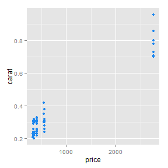
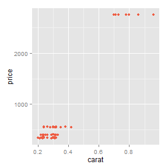

# reveal.js

Presentation template using slidify and reveal.js

<script src="http://ajax.googleapis.com/ajax/libs/jquery/1.9.1/jquery.min.js"></script>

---

### The basics

[Slidify](http://www.slidify.org) is an R package that compiles [R-Markdown](http://rmarkdown.rstudio.com/) scripts into html slideshows. The conversion from R-Markdown to html is done via "frameworks." [reveal.js](http://revealjs.com/) is one such framework. This template serves to illustrate some useful features of both slidify and reveal.js.

--- 

# Backgrounds

--- ds:soothe

"soothe"

--- ds:alert

"alert"

--- ds:mint

"mint"

--- ds:blackout

"blackout"

--- ds:whiteout

"whiteout"

--- ds:sunset

"sunset"

--- ds:greenjs

And finally a custom one in /assets/css/custom.css.

---

# Code

---


```r
library(ggplot2); library(ggthemes)
qplot(rnorm(1000), rnorm(1000)) + theme_pander()
```


---

### Animations


```r
for (i in 1:10){
    print( qplot(rnorm(100), rnorm(100)) + 
              scale_y_continuous(limits=c(-2,2)) +
              scale_x_continuous(limits=c(-2,2)) + theme_pander() ) }
```

<video width="360"  controls loop><source src="assets/fig/animation-.webm" />video of chunk animation</video>

---

# Text Effects

--- 

# Level 1 header
## Level 2 header
### Level 3 header
#### Level 4 header
Reg. text.  
<small>
    Small text.  
    [Link](http://mvuorre.github.com)
</small>

---

### Incremental reveal

.fragment You can reveal...  

.fragment ...text incrementally... 

.fragment ...by prepending text with ```.fragment```.

---

### HTML

With a little bit of HTML, we can do all sorts of things.

<ol>
<li class="fragment roll-in">roll-in</p>
<li class="fragment fade-in">fade-in</p>
<li class="fragment highlight-red">highlight-red</p>
<li class="fragment highlight-green">highlight-green</p>
<li class="fragment highlight-blue">highlight-blue</p>
</ol>

<div class="fragment grow">grow</div>
<div class="fragment shrink">shrink</div>

---

### Math<small>jax</small>

$p(\theta|D) = \frac{p(D|\theta) p(\theta)}{p(D)}$

---

# Layouts

---

### Text side by side

```<div class="twocol">```

<div class="twocol">
Lorem ipsum dolor sit amet, consectetuer adipiscing elit, sed diam nonummy nibh euismod tincidunt ut laoreet dolore magna aliquam erat volutpat. Ut wisi enim ad minim veniam, quis nostrud exerci tation ullamcorper suscipit lobortis nisl ut aliquip ex ea commodo consequat. Duis autem vel eum iriure dolor in hendrerit in vulputate velit esse molestie consequat, does anyone ever read these. Nam liber tempor cum soluta nobis eleifend option congue nihil imperdiet doming id quod mazim placerat facer possim assum. Typi non habent claritatem insitam; est usus legentis in iis qui facit eorum claritatem. Investigationes demonstraverunt lectores legere me lius quod ii legunt saepius.
</div>

--- 

### Images side by side

We can put two images side by side using css in /assets/css/...

<div class="twocol">  


</div>

--- &twocol

### R plots side by side

Or by using a slide template saved as _templatename.html_ in /assets/layouts/

*** =left
 

*** =right
 

*** =fullwidth
This is better for plots generated in R. Using ```grid.arrange()``` would probably be best for these.

---

# Miscellaneous

---

### Keyboard shortcuts

- Press escape to zoom out, and alt+click to zoom in
- b for blackout
- f for fullscreen
- s to show slide notes

--- 

### Embedded website

<iframe src='http://rpubs.com/mv2521/mcmc-animation' width = '100%' height = '640px'></iframe>

--- 

### Embedded shiny app

<iframe src="https://jalapic.shinyapps.io/soccerteams/" width="100%" height="640px">Get a better web browser</iframe>

---

# Notes

---

- use clear header structure and line folding in R-Studio.
    - Helps organize slides with lots of content
- works best with Chrome
